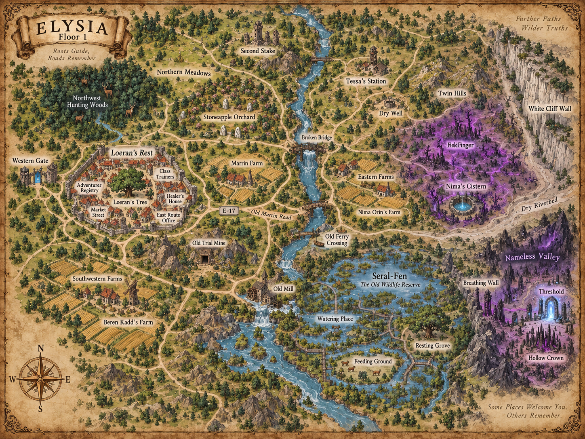

# Elysia — Level Design

*Floor 1 — Loeran’s Rest és a keleti vadon*

> Ez a dokumentum nem új lore-fejezet.
>
> A célja az, hogy a már elfogadott történetet, questeket és világlogikát **konkrét, megépíthető térként** írja le.
>
> Egy environment artistnak vagy level designernek ebből a dokumentumból el kell tudnia készíteni az első grayboxot anélkül, hogy újra ki kellene találnia, merre van egy út, mit kell látnia a játékosnak egy dombtetőről, vagy milyen hangulati átmenet vezet Loeran’s Restből a Hollow Crown völgyéig.

## Áttekintő térkép

  

  <em>Elysia Floor 1 — ortografikus zónatérkép, a fő landmarkokkal, quest-régiókkal és a Hollow Crown útvonalával.</em>

---

## 0. A terület alapgondolata

Elysia első játszható régiója nem úgy néz ki, mint egy klasszikus MMO-zóna, amelynek négy oldalát hegyfal vagy láthatatlan fal zárja le.

A játékosnak azt kell éreznie, hogy egy **sokkal nagyobb világ nyugati, újra birtokba vett peremén** jár.

Loeran’s Rest a biztos pont.

Tőle nyugatra a Kapu van, azon túl Brink Valley.

Tőle keletre egyre kevésbé ismert utak, régi Point One-i infrastruktúra, farmok, vadrezervátumok és olyan területek következnek, amelyeket tizenkét év alatt sem sikerült teljesen visszaszerezni.

A játszható Floor 1 régió ezért nem Elysia teljes földrajzi kiterjedése.

A távoli horizontnak minden fontos irányban azt kell sugallnia, hogy a világ folytatódik.

A jelenlegi content footprint egy **Loeran’s Rest köré szerveződő, nagyjából 4.8 km × 4.2 km-es aktív terület**.

Ez blockout-célérték.

Nem lore-mértékegység.

A fejlesztés során ±10–15% eltérés elfogadható, ha az utazási idő vagy a látvány ezt indokolja.

A terület nyugati széle Loeran’s Rest és a Kapu.

A fő Main Quest kelet felé húzza a játékost.

A Side Questek északra, északnyugatra, délre, délnyugatra, a folyó túloldalára és a föld alá széthúzzák.

A terület **nem küllős kerék**.

Nem minden út Loeran’s Restből sugárzik tökéletesen kifelé.

A régi Point One-i utak egymást metszik, megszakadnak, elmosódnak, néhol pedig új telepesutak vágnak át rajtuk.

Ez fontos.

A világ ne érződjön „quest hubból kinyúló pályáknak”.

---

## 1. Koordináta- és tájolási rendszer

A grayboxban Loeran fája legyen a világterület helyi referenciapontja:

**Loeran fája = X 0 / Y 0 / Z 0**

Az egyszerűség kedvéért:

- pozitív Y = kelet;
- negatív Y = nyugat;
- pozitív X = észak;
- negatív X = dél;
- Z = magasság.

A Kapu Loeran fájától nagyjából **620 méterre nyugatra**, enyhén délnyugati irányban álljon.

A keleti Main Quest útvonal végső aktív területe, a Névtelen Völgy és a Threshold, a főtértől nagyjából **3.3–3.7 km-re keletre** helyezkedjen el.

Ez nem Elysia keleti széle.

A horizont a Threshold mögött is folytatódik.

Az északi Side Quest területek nagyjából 1.5–2.2 km-rel húzódjanak a főtér fölé.

A déli fennsík és malomvölgy hasonló távolságban terüljön el délre.

A játékosnak teljes, már feltárt útvonalon:

- Loeran’s Restből a Marrin-farmig körülbelül 60–90 másodperc;
- az E-17 oszlopig 2 perc körül;
- a kompig 4–5 perc;
- Seral-Fenig 7–9 perc;
- a Hollow Crown területéig 10–13 perc

futási idővel kell számolnia mount nélkül.

Az első bejárás természetesen hosszabb.

A játékos keres.

Megáll.

Harcol.

Letér az útról.

Fog of Wart tisztít.

A visszaút később rövidebbnek érződik, mert már tudja, merre kell menni.

---

# I. A Nyugati Kapu és Loeran’s Rest

## 2. Az érkezési tér

A játékos Elysiában először nem várost lát.

Először **teret** érez.

Brink Valley után az ég legyen a fő vizuális sokk.

A Kapuból kilépve a kamera előtt ne legyen azonnal magas házfal.

A terep enyhén lefelé fusson 15–20 méteren keresztül, majd egy szélesebb, nyitott rakodótér következzen.

A Kapu maga egy kb. négy méter magas, masszív keret.

A felület halványkék.

Nem tükröz.

Nem áttetsző.

Nem látszik benne Brink Valley.

A Kaputól 20–30 méterre állhatnak a működő őr- és rakodóépületek.

Ezek **nem a Threshold körüli későbbi infrastruktúra**, hanem a történelmileg régóta használt Brink–Elysia átjáró kiszolgáló építményei.

A nyugati Gate-yard legyen körülbelül 70 × 90 méteres.

Ne legyen katonai erőd.

Inkább határátkelő és raktári előtér.

A föld:

tömörített világosbarna talaj;

helyenként kőlapok;

sok keréknyom;

fa raklapok;

alacsony raktárépületek.

A játékosnak egyetlen pillantással értenie kell:

**ezen a Kapun naponta közlekednek.**

Az első fő vizuális irányítóelem a Loeran’s Rest felé vezető kövezett út.

A Gate-yardból két kisebb szervizút is kifuthat, de az egyik zsákutcába, raktárakhoz, a másik istállókhoz vezessen.

A főút legyen 6–7 méter széles.

Két szekér kényelmesen elfér egymás mellett.

A Gate-yard és a város között ne legyen hosszú üres mező.

A Kapu körül tizenkét év alatt kialakult egy új építési sáv.

Ez Loeran’s Rest legfiatalabb része.

---

## 3. A Kapu-negyed

A Kaputól a főtér felé vezető első 250–300 méter **új Loeran’s Rest**.

Itt az épületek szabályosabbak.

Kőalap.

Fa felső szint.

Nagyobb raktárkapuk.

Rakodóteraszok.

A házak között szélesebb utca.

A fejlesztő számára fontos vizuális szabály:

**minél közelebb vagyunk a Kapuhoz, annál újabb és praktikusabb az építészet.**

A falak kevésbé foltozottak.

Kevesebb régi Point One-i rom van beépítve.

A főút jobb oldalán legyen két nagy raktár.

Bal oldalon kisebb kereskedőház, istálló és egy javítóműhely.

A rakodó NPC-k itt jelennek meg.

Oren Marr.

Barek Voss.

Tila Venn.

Ők ne blokkolják a játékos útját.

A környezet legyen élő, de production-szempontból statikus:

ládák;

szekér;

két-három ambient idle NPC;

egy öszvér;

füstölgő kis javítótűz.

Nem kell komplex napi rutin.

A Kapu-negyed végén az út enyhén emelkedni kezd.

A főtér Loeran fájával még ne legyen teljesen látható.

Először csak a fa koronájának felső része bukkanjon fel a háztetők fölött.

Ez az első tudatos landmark.

---

## 4. Loeran’s Rest városszerkezete

Loeran’s Rest ne legyen nagy.

A teljes, sűrűn beépített városi mag átmérője nagyjából **550–650 méter**.

A játékos egyik végéből a másikba 2–3 perc alatt átérhet gyalog.

A város alakja nem szabályos kör.

Nyugat felől a Kapu-út benyomul a régi Point One városszövetébe.

Keleten a beépítés fokozatosan ritkul.

Északon kisebb piacok és műhelyek.

Délen régi falalapok, csatornák, majd kertek.

A város történetének vizuálisan olvashatónak kell lennie.

Három réteg legyen felismerhető.

Az első:

**Point One régi kövei.**

Sötétebb, kopottabb alapfalak.

Félig földbe süllyedt lépcsők.

Elfalazott ajtók.

Száraz kutak.

Második:

**az újratelepülés első éveinek épületei.**

Gyorsan épített fa.

Szabálytalan illesztések.

Foltozott tetők.

Harmadik:

**az utóbbi évek stabil városa.**

Tudatosabb építés.

Kőalap.

Rendes ablakok.

Vegyes mesterségek jelei.

A három korszak gyakran ugyanazon az épületen legyen látható.

Ez sokkal fontosabb, mint az, hogy minden ház külön modell legyen.

---

## 5. A főtér és Loeran fája

A főtér Loeran’s Rest vizuális és navigációs közepe.

Nem hatalmas piactér.

Körülbelül **65 × 80 méter**.

Enyhén szabálytalan.

A burkolat nem teljesen kő.

Középen tömörített föld és gyökerek.

A széleken régi kőlapok.

Loeran fája ne pontosan geometriai középpontban álljon.

Kicsit északnyugatra tolva természetesebb.

A fa törzse vastag, de nem monumentális fantasy-fa.

Mature tree.

Valóságos.

A koronája elég nagy ahhoz, hogy a téren belül árnyékot adjon.

A fa körül **ne legyen kerítés**.

Ne legyen emelvény.

Ne legyen szobor.

A gyökérnél alacsony kő.

Név nélkül.

A környezetben 3–4 pad.

Egyik alatt lehet a Side Quest csomag.

Edrin Sael a fa egyik oldalán álljon úgy, hogy a játékos a főútról érkezve ne őt, hanem először a fát lássa.

A főteret úgy kell kialakítani, hogy innen négy fontos irány vizuálisan megjegyezhető legyen.

Nyugat:

a Gate-road.

Kelet:

Maren irodája és a keleti kijárat iránya.

Észak:

piac és class trainer utcák.

Dél:

Kalandorügyi Hivatal és a régi alsó város.

A fa ezért természetes orientációs pont.

A játékos térkép nélkül is tudja:

„ha visszatalálok a fához, újra tudom rendezni magam.”

---

## 6. Kalandorügyi Hivatal

Illa Orin épülete a főtér délnyugati oldalán legyen.

Körülbelül 35 × 25 méter footprint.

Kétszintesnek látszódhat, de Alpha scope-ban a játékos által bejárható rész elég, ha földszint + kis emeleti folyosó.

Az épület valóban úgy nézzen ki, mintha háromszor bővítették volna.

Az eredeti kőházhoz egyik oldalon fa toldalék.

Ahhoz újabb, keskenyebb toldalék.

A tetősíkok nem találkoznak szépen.

Ettől lesz karaktere.

A belső tér ne legyen hatalmas MMO guild hall.

Pult.

Polcok.

Könyvek.

3–4 ügyfél.

Egy lépcső.

Egy oldalsó irattár.

Illa pultja mindig ugyanott.

A városi térkép átadása itt történik.

A falon lévő nagy Elysia-térkép legyen látható, de ne legyen interaktív full-map unlock.

Ez fontos vizuális tanítás:

**mások többet tudnak a világról, mint amit a te karaktered saját térképe mutat.**

---

## 7. A class trainer udvar

A hat class trainer ne hat egymástól kilométerekre lévő épületben legyen.

A főtértől északkeletre legyen egy **közös képzőudvar**, amely körül hat kisebb terem nyílik.

Udvar:

kb. 45 × 55 méter.

Középen egyszerű gyakorlótér.

Fa targetek.

Közelharci bábu.

Íjász célpont.

Mana-gyakorló kristály helyett egyszerű, nem-lore-törő mérőcélpontok.

A hat terem vizuálisan különbözhet, de ugyanazt a moduláris épületkitet használja.

Warrior:

nehéz faállványok.

Assassin:

keskenyebb, árnyékos terem.

Mage:

mérőrudak, égésnyomok, távolságtartó zóna.

Ranger:

nyitott hátsó lőfolyosó.

Cleric:

egyszerű gyógyítóhely és gyakorlóasztal.

Adept:

szabad padló, kevés tárgy.

A class trainer udvar legyen a főtértől 30–40 másodpercre.

Mivel minden level után vissza akarjuk küldeni ide a játékost, **nem lehet kényelmetlen helyen**.

---

## 8. A keleti kapu és Maren irodája

Loeran’s Rest keleti kijárata ne masszív városfal-kapu legyen.

A város nem erőd.

Inkább két régi Point One-i kőfalmaradvány közötti ellenőrzött út.

Az egyik oldalon Maren Dorr kis irodája.

A másikon felszerelés-ellenőrző pad és két őr.

Maren irodája legyen olyan helyen, ahonnan **látja az útra indulókat**, de nem kell kijönnie.

Egy ablak az útra.

Egy térképasztal.

Falra tűzött jelentések.

Az iroda előtt tábla, ahol más Kalandorok rövid ideig megállhatnak.

A keleti kijárat után 60–80 méterrel a városi térkép által ismert utolsó házak elfogynak.

Itt kezdődik a Fog of War szempontjából valódi Elysia.

A határ ne legyen fal.

A burkolt út egyszerűen kavicsos, majd földút lesz.

A házak helyét kertek és sövények váltják fel.

A játékos érzi, hogy elhagyta a várost.

---

# II. A közeli földek

## 9. Marrin-farm

A Marrin-farm Loeran’s Rest keleti szélétől kb. 500–650 méterre legyen.

Ez még félig civilizált terület.

A farm ne elszigetelt tanya legyen a vadon közepén.

A város és a farm között kisebb kertek, kerítések, gyümölcsösök és két-három használatban lévő földcsík is legyen.

Halen Marr birtoka:

egy lakóház;

egy kis pajta;

régi Point One-i kőfal;

új kerítések;

gyümölcsös;

keserűlevéllel benőtt nedvesebb árok.

A ház ne legyen nagyobb 12 × 18 méternél.

Az egész aktív farmterület kb. 120 × 160 méter.

Itt még ne legyen agresszív enemy density.

Egy normál vaddisznó időnként megjelenhet a kerítésnél.

A farm vizuális feladata:

**megmutatni, hogy Elysia nem csak veszélyforrás, hanem élő erőforrás.**

A föld gazdag.

A növényzet sűrű.

A fák egészségesek.

A későbbi Field-zónák torzulásai így kontrasztot kapnak.

---

## 10. A déli malomút

A Marrin-farm déli oldaláról egy keskeny mellékút vezessen a régi malmok felé.

Ez a Side Quest útvonal.

A Main Questből látható legyen a leágazás, de ne kényszerítse oda a játékost.

A leágazás landmarkja:

alacsony kőhíd;

régi malomkő az út mellett;

vízcsobogás.

Az Old Mill 600–800 méterre legyen a farmtól.

Az út közben patakot követ.

Fokozatosan mélyülő, zöld völgy.

A domboldalakon fák.

Nem ősi erdő.

Elysia természetes erdősége, de világosabb és nyitottabb, mint a későbbi veszélyes területek.

Az első malom:

kétszintes fa-kő épület.

Két vízkerék helye.

Az egyik működőképes.

A másik megállt.

Alul bejárható vízjárat.

A játékos ugyanazon épületet több quest objective-re használja.

Production szempontból ez jó sűrű tartalom.

A harmadik vízkerékhez vezető csatorna innen délkelet felé tűnik el.

A Side Quest során a játékos egy sűrűbb ligetbe kerül.

A harmadik malom már rom.

Ne legyen belőle új település.

A vízkerék félig mozdul.

A tető hiányzik.

Egy fal áll.

A rókalyuk és Meral Tonn naplója itt található.

---

## 11. Délnyugati farmok

Loeran’s Resttől délkelet–dél irányban, de a Main Quest fő keleti útjától elkülönülve legyen Beren Kadd farmja.

A cél nem új biome.

Ugyanaz a civilizációs perem más problémával.

A táj enyhén hullámos.

Sok kerítés.

Kőalapok.

Szétszórt istállók.

Beren farmját a kerítésrendszer teszi felismerhetővé.

Három korszak.

Három külön anyag.

Régi Point One-i kőalap.

Első új fakerítés.

Második erősített szakasz.

A játékos egy pillantásra lássa:

ezt tényleg többször újraépítették.

A quest combat arena ne külön aréna legyen.

A vaddisznók a földek felől jönnek.

A ház és a pajta között van elég hely két kisebb hullám kezelésére.

---

# III. Az első ismeretlen utak

## 12. Az E-17 felé vezető út

A keleti városkapu után a főút először könnyen követhető.

Ez szándékos.

A játékosnak nem az első 30 másodpercben kell elvesznie.

Az út 4–5 méter széles.

Két sekély keréknyom.

Fű a közepén.

Az első 300 méteren nyílt, hullámos mezők.

Ezután alacsony facsoport.

Az E-17 oszlop kb. 850–950 méterre legyen Loeran fájától.

A jelzőoszlopot ne állítsuk az út közepére.

Kissé oldalra dőlve, egy régi kerítésmaradványnál.

A játékosnak észre kell vennie.

De ne legyen pixelvadászat.

Az oszlop körül 15–20 méteres tisztás.

A háttérben már látszódjon a kelet felé folytatódó régi út.

Innen a Loeran’s Rest háztetői már csak részben látszanak.

A város biztonságérzete kezd eltűnni.

---

## 13. A régi Marrin-út

Az E-17 után az út romlani kezd.

Nem azonnal lesz vadon.

Először elhanyagolt infrastruktúra.

Kidőlt szekér.

Félig benőtt őrbódé.

Régi útkereszteződés.

A három Main Quest inspect-pontot úgy kell elhelyezni, hogy természetes mini-ív legyen.

Az első 300 méterre az E-17-től.

A második 250 méterrel később.

A harmadik egy magasabb útkereszteződésnél.

A játékos minden pont után kicsit mélyebbre kerül.

Enemy density:

alacsony–közepes.

Normál Wolf.

Normal Boar.

Ne legyen minden tíz méteren mob.

A játékosnak legyen ideje környezetet olvasni.

A halott Rewritten farkas egy olyan útszéli mélyedésben legyen, ahol a játékos szinte biztosan észreveszi, de mégis úgy néz ki, mintha nem „quest objectként” tették volna oda.

A lábnyomok kelet felől érkezzenek.

Vizualizálhatók sárban.

Nem kell világító trail.

---

## 14. A száraz kút és Tessa útvonala

A Tessa felé vezető út már ne legyen egyetlen tiszta út.

Maren csak tájeleket ad.

A száraz kút legyen egy régi farmalap mellett.

A kettétört fehér nyár kb. 250 méterre északkeletre.

Fontos, hogy tényleg fehér kérgű és látványosan félbetört legyen.

Innen balra nincs rendes út.

Keskeny ösvény.

A köves patakmeder túlhaladási landmark.

Ha a játékos eléri, tudja, hogy túlment.

Tessa mérőállomása kis, nyitott területen álljon.

Nem település.

Egy fedett munkapad.

Egy alacsony esőtető.

Mérőállvány.

Két láda.

Egyetlen keskeny ösvény vissza nyugatra.

Az állomás kb. 1.4 km-re lehet Loeran’s Rest főterétől.

A környék még nagyrészt normál.

Itt kezdjük a Field vizuális tanítását.

---

## 15. A három mérési pont

A három pont Tessa körül háromszögben helyezkedjen el.

Ne egymás után egy lineáris ösvényen.

A játékosnak egy kis területet tényleg fel kell fedeznie.

### Kidőlt tölgy

Tessa állomásától északra 180–220 méter.

Egészséges környezet.

Normál ambient.

### Sekély tó

Kelet-délkeletre kb. 250 méter.

Nád.

Békák.

Rovarhang.

Még mindig normál.

### Kopár folt

Északkeletre kb. 300 méter.

Ez legyen az első olyan hely, amely vizuálisan nem harsány, mégis zavaró.

A kopár rész 20–30 méter átmérőjű.

Nem fekete föld.

Nem kráter.

Egyszerűen nincs növény.

A környező fű élesen nem áll meg, inkább fokozatosan ritkul.

Az audio itt fontosabb a textúránál.

Madárhang kevesebb.

Rovarhang eltűnik.

A szél tompul.

A játékos ne kapjon nagy vörös „danger zone” jelzést.

A tér maga tanít.

---

# IV. Az eltűnt járőr útja

## 16. A régi malomrom

A három eltűnt járőr utolsó biztos pontja egy másik, kisebb malomrom legyen, ne keverjük össze a déli Side Quest malommal.

A könnyebb production miatt ugyanaz a moduláris malom-kit használható, de más elrendezéssel.

Ez a rom a keleti főút északi leágazásánál álljon.

A táj itt sűrűbb.

Fák közelebb az úthoz.

A látótávolság csökken.

A játékos először Derr zsákját találja.

Aztán Leth nyílvesszőjét.

Nima mérőtokját.

A három nyom ne legyen egymástól tíz méterre.

A játékosnak 150–250 méter közötti szakaszt kelljen követnie.

A nyomvonal lassan leválik az útról.

Belép egy erdősávba.

A canopy sűrűbb.

A talaj sötétebb.

Nem Saturation miatt.

Egyszerűen erdő.

Ez fontos, hogy a játékos ne minden sötétebb helyet Rewrite-ként olvasson.

---

## 17. Derr és Leth helyszíne

A holttestek ne egymás mellett feküdjenek.

Derr egy alacsony köves mélyedés mellett.

Leth 40–60 méterrel tovább, egy fa közelében.

A magas karmolások a fán kb. 2.5–3 méter magasan kezdődjenek.

Ettől világos, hogy nem normál farkas.

Nima földbe vésett Korona-jele ne közvetlenül a holttestek mellett legyen.

Még 20–30 méterrel keletebbre.

Mintha Nima továbbjutott volna.

Az egész helyszín arról szóljon:

**valami történt itt, és a harmadik ember nem ugyanott ért véget.**

Derr levele Side Quest hook.

A levél felvétele ne állítsa meg a Main Quest flow-t.

---

# V. A Második Cölöp és a magasabb tér

## 18. A három jelentés területe

Coll Marr vadászpontja, Sella Dorn farmja és a karmolt oszlop ne ugyanabban a kis körben legyen.

A Main Quest arra használja őket, hogy a játékos térben is érzékelje:

a jelenség nem egyetlen pont.

Coll Marr északnyugati erdőszélen.

Sella Dorn keletebbi farmon.

A karmolt oszlop a kettő között, magasabb úton.

E három pont nagyjából 600–800 méteres háromszöget adjon.

A játékos saját térképén már kezd kialakulni a környék.

A három megfigyelés mind kelet–északkelet felé nyomja a figyelmet.

Nem kell nyilat rajzolni.

A terep orientációja segít.

A dombgerincek kelet felé nyílnak.

---

## 19. Második Cölöp

A Második Cölöp az első nagy, távolról látható romlandmark.

Egy 18–22 méter magas régi őrtorony.

A felső harmada sérült.

Az egyik oldala leomlott.

A fő lépcső hiányzik.

A torony egy kb. 25 méterrel a környező terep fölé emelkedő dombon áll.

Ez nem hegy.

Széles, füves magaslat.

A játékos már 500–700 méterről láthatja a torony csonkját.

A toronyhoz vezető direkt út megszakadt.

A kerülő ösvény a domb oldalában kanyarog.

Ez ad természetes explorationt.

A torony tetejéről a játékosnak három irányban tiszta view corridor kell.

Dél:

vékony füst a déli romok felől.

Észak:

mozgó állatcsorda a réteken.

Kelet:

egy sötétebb erdősáv, amely fölött feltűnően kevés madár.

A player camera szintjén ezek tényleg láthatók legyenek.

Nem csak quest textben létezzenek.

A torony belsejében van a Side Quest doboz.

A távcső fix interact object.

A távcső használatakor lehet enyhe zoomolt kamera, de ne teleportáljon külön cutscene-be.

---

# VI. Az északi kitérők

## 20. Kőalmás-kert

Kőalmás-kert a keleti gazdaságoktól északra fekvő, enyhén zárt völgy.

A bejáratot két fehér szikla jelöli.

Ez legyen erős landmark.

Két 8–12 méter magas, világos mészkő- vagy hasonló sziklatömb.

Köztük 12–15 méteres átjáró.

A talaj a bejárat után vörösebb.

Nem fantasztikus vörös.

Vasban gazdag föld.

A kert 180 × 220 méter körüli.

Alacsony, csavarodó gyümölcsfák.

Ritkább aljnövényzet.

A középső nagy fa köré épül a személyes Side Quest.

A két régi kéznyom és a `D + R` jel legyen közel egymáshoz, de ne ugyanazon objektumon.

A Rewritten Boarok a kert túlsó harmadában legyenek.

A hely első fele békésnek tűnik.

Aztán fokozatosan derül ki, hogy a Rewritten jelenlét már ide is elért.

---

## 21. Északi rétek és méhes

A Kőalmás-kerttől nyugat–északnyugatra nyíljon ki a táj.

Széles rétek.

Kevés fa.

A játékos innen messzebbre lát.

Ez vizuális pihenő a sok erdős rész után.

Neral Thael kaptárjai egy enyhe déli lejtőn állnak.

Három kaptár közel egymáshoz.

Az új vadméh-odú 150–200 méterre, egy kidőlt fában.

A quest úgy viszi át a játékost a réten, hogy közben új Fog of War területet fed fel.

Enemy density alacsony.

Normál állatok.

Ez ne legyen veszélyes zóna.

A Side Quest értéke az ökológiai lore.

---

## 22. Északnyugati vadászerdő

Coll Marr Side Quest területe Loeran’s Rest és a Második Cölöp közötti északnyugati erdő.

Itt a játékos már lehet, hogy korábban is járt.

A Side Quest viszont új, mélyebb ösvényt tár fel.

A vadászösvény kezdetben tiszta.

Aztán kettéválik.

Az állatnyomok egyre inkább elkerülnek egy központi sziklamezőt.

A kopár Saturation-folt ne ugyanúgy nézzen ki, mint Tessa első kopár foltja.

Itt a kövek között mohamentes, halványabb terület.

A hang ugyanúgy változik.

Ezzel megtanítjuk:

a Field jelei nem mindig azonos vizuális prefabok.

---

# VII. A folyó és az átkelés

## 23. A törött híd

A fő keleti út végül egy valódi folyóhoz ér.

A folyó legyen 18–25 méter széles.

Elég széles ahhoz, hogy ne lehessen egyszerűen átugrani.

A sodrás látható.

A fő híd kő-fa szerkezet.

Középső 8–10 méteres szakasza hiányzik.

A túlpart látszik.

A játékos érti, hol folytatódna az út.

De nem jut át.

A híd körül régi szekérmaradvány.

Kőpillérek.

A quest először északra küld keresni.

Ott a part meredekebbé válik.

Nem használható.

Dél felé a part laposodik.

Itt található a komp.

A játékos saját döntésének kell érződnie, még ha quest objective támogatja is.

---

## 24. A régi kompállás

A kompállás a hídtól 350–450 méterre délre.

A folyó enyhén szélesebb, de lassabb.

Egyik parton régi fa rámpa.

Másik oldalon hasonló.

Jarek Dorr és Nessa Keln itt dolgoznak.

Kis fedett munkapad.

Kötélcsévélő.

Deszkák.

Nem település.

A komp egyszerű lapos platform.

A Main Quest repair nem crafting system.

Három quest-interact.

Deszka.

Kötél.

Rögzítés.

A `HALDEN` Side Quest jelek a kompállás szerkezetén legyenek.

A játékos így ugyanazon helyen Main és Side tartalmat kap.

A komp használata után ne legyen hosszú cinematic.

Rövid, 10–15 másodperces automatikus átkelés vagy egyszerű platformmozgás.

A játékos közben körbenézhet.

---

## 25. Halden északi folyópartja

A túlpart északi Side Quest területe eltérő hangulatú.

Nádas.

Sekély tavak.

Vizes talaj.

Sok ambient állat.

A fő Main Quest nem viszi ide.

Ez tudatos térkitöltés.

A régi csónakroncs félig sárban.

A gázló még 300–400 méterrel északabbra.

A négy régi sírjel kis, száraz dombon.

A terület határa ne legyen hegyfal.

A mocsár fokozatosan egyre mélyebb, sűrűbb és content nélkülibb lesz, így természetesen fordítja vissza a játékost.

Ha technikai boundary kell, növényzettel, mély vízzel és meredek folyómederrel rejtsük.

---

# VIII. A keleti gazdaságok

## 26. Az átkelés utáni első tér

A folyó túloldalán a játékos ne azonnal erdőbe érkezzen.

Először szélesebb régi gazdasági terület.

Ez narratív kontraszt.

Valaha itt éltek.

Az út mentén kőkerítések.

Öreg gyümölcsfák.

Összedőlt pajták.

Elszórt házalapok.

A három Ledger-tábla három külön farmnál legyen.

A farmok egymástól 180–250 méterre.

A játékosnak tényleg be kell járnia a területet.

Az első farm:

majdnem teljesen rom.

Második:

részben álló pajta.

Harmadik:

Nima családi farmjához közelebb, jobban megmaradt épület.

Enemy density közepes.

Normál és ritka Rewritten fauna vegyesen.

Nem szabad azt sugallni, hogy a folyó túloldalán minden azonnal „korrupt”.

---

## 27. Nima Orin családi farmja

Nima farmja vizuálisan felismerhető legyen.

Kékes-szürke kőalap.

Egy félig álló kétszintes ház.

Oldalán régi Gnome mérőjelzések.

A pince vagy alsó szoba jobban megmaradt.

Itt van a friss gyertya.

Kötés.

Üres víztartó.

A falra karcolt:

**Nem egy.**

**Követik.**

A farm mögött a három különböző nagy nyomtípus.

A nyomok ne legyenek óriási fantasy footprints.

Egyik pata.

Egyik mancs.

Egyik szabálytalan, nehezen olvasható.

Mind nyugat felé mutatnak.

A játékos itt először érzi:

nem egyetlen állat a probléma.

A térség maga tol valamit kifelé.

---

# IX. A Field ujja

## 28. A Saturation átmenet

A „csend ujja” ne legyen térképen szabályos folt.

Terepileg egy hosszú, keskeny völgy- és erdősáv, amely keletről nyugat felé nyúlik.

A játékos először a szélét követi.

A level designnak öt fokozatban kell átvezetnie.

### 1. Normál

Teljes madár- és rovarhang.

Egészséges fű.

Normál fauna.

### 2. Enyhe

Kevesebb madár.

Egy-egy elhagyott állatnyom.

Néhány növény halványabb.

### 3. Közepes

Az állatok nyugat felé mozognak.

Néhány Rewritten mob.

A szél hangja tompább.

### 4. Magas

Lila hajszálrepedések egyes állatokon.

Kevesebb ambient fauna.

Sötétebb talaj nem kötelező.

### 5. Teljes csend

A környezet még mindig valós hely.

De audio szinte üres.

Itt a quest visszavonulást kér.

A játékosnak éreznie kell:

továbbmehetne.

De most nem kell.

Ez Saelin tanításának térbeli megvalósítása.

---

## 29. Nima vízgyűjtője

A füst egy enyhén magasabb pontról legyen látható.

Nem óriási füstoszlop.

Vékony szürke csík.

A vízgyűjtő egy régi Point One-i kőmedence és föld alatti tároló.

Kívülről alig látszik.

Kőfal.

Félig benőtt lépcső.

Alsó kamra.

Nima itt fekszik.

Nem kell mozgó rescue sequence.

A helynek menedék-jellege legyen.

Nima lezárta vagy eltorlaszolta az alsó ajtót.

Kis tűz.

Üres kulacs.

Mérőeszköz.

A három tájjel rajza a falon vagy papíron.

Kettős domb.

Száraz meder.

Fehér sziklafal.

A játékos innen új térbeli célt kap.

---

# X. A három jel vidéke

## 30. Kettős domb

A kettős domb két alacsony, egymáshoz közel álló, lekerekített magaslat.

Ne legyen monumentális.

15–20 méter relatív magasság.

Messziről két külön púp.

Ez a landmark.

A két domb közötti nyeregben régi ösvény fut.

A játékos itt kelet felé fordul.

---

## 31. A fehér sziklafal

A fehér sziklafal 10–15 méter magas, hosszú kőletörés.

Nem ugyanaz, mint Kőalmás-kert két fehér sziklája.

Ott két külön álló tömb.

Itt folytonos fal.

A sziklafal segít a játékosnak megtalálni a száraz meder térségét.

A fal tövében kevés növény.

A tetején fák.

A játékos nem mászik fel.

Legalábbis a launch scope-ban.

---

## 32. A száraz folyómeder

A száraz meder az egyik legerősebb természetes navigációs vonal.

6–12 méter széles.

Kavics.

Kerek kövek.

Régi vízmosás.

Az egykori folyó kelet–nyugat irányban futott.

A játékos kelet felé követi.

Az útvonal lassan mélyül.

Oldalfalai magasabbak lesznek.

A környezet hangja csökken.

A meder végül a Seral-Fen környékére vezet.

A játékos térképen is könnyen felismeri később.

Ez lesz az egyik visszaút-jelzőpont.

---

# XI. Seral-Fen

## 33. A rezervátum bejárata

Seral-Fen ne nézzen ki „boss zónának” az első pillanatban.

Régi vadrezervátum volt.

Ezért szélesebb füves tisztások.

Erdős foltok.

Vadcsapások.

Régi alacsony kerítések.

A rezervátum kapuja már nincs.

Csak két kőoszlop és egy ledőlt tábla.

**SERAL-FEN VADREZERVÁTUM**

Az őrház közvetlenül mellette.

Kis, egyemeletes kő-fa épület.

Részben beomlott tető.

Belül polcok.

Irattartók.

Régi térkép.

A nagy hímről szóló jelentések itt.

A környezet legyen nyugtalanító, de még ne teljesen idegen.

A Field erősebb.

Crowned nyomok már előfordulnak.

---

## 34. A vízlelőhely

A rezervátum északi részén kis, állandó forrás.

Sziklák közül ered.

Sekély medence.

Körülötte sok állatnyom.

Ez logikus gyülekezőhely.

A játékos itt azt várja, hogy megtalálja a Bosst.

Nem találja.

Ez level-design szempontból fontos hamis hipotézis.

A terület nagyjából 70 × 90 méteres nyitott tér.

Több kijárat.

Ne legyen boss arena formája.

---

## 35. A táplálkozóhely

A régi gyümölcsös a rezervátum keleti-középső részén.

Nagyobb fák.

Feltépett kéreg.

Letört ágak.

Nagy patanyomok.

A játékos itt másodszor érzi:

„közel vagyok”.

De a Hollow Crown csak járt itt.

A terület a vízforrástól kb. 300–400 méterre.

Közöttük kisebb erdősáv.

A két hely ne legyen egyszerre belátható.

---

## 36. A fekvőhely

A fekvőhely már magasabb Saturation.

A liget enyhe magaslaton.

Letaposott központi rész kb. 25–30 méter átmérővel.

A fák ritkábbak.

A lila jelek először a leveleken és a Crowned csontdarabokon jelennek meg.

A sziklafal a liget mögött zárja le a látványt.

Ez tudatos false dead-end.

A játékos azt hiszi:

„itt vége.”

A Main Quest azonban azt kéri, hogy vizsgálja meg.

A repedés pontos helyét nem marker adja.

A növényzet és a szél.

---

# XII. A fal, amely lélegzik

## 37. A rejtett sziklarés

A sziklafal hossza legalább 120–160 méter legyen.

A rés ne középen legyen.

Kicsit északra tolva.

Az előtte lévő fű 10–15 méteres sávban következetesen a fal felé hajlik.

A levelek is.

Apró porszemek befelé mozognak.

Ha audio megoldható, halk huzathang.

A rés kívülről 1.5–2 méter széles.

A játékos befér.

Mount nem.

A sziklarés 20–30 méter hosszú természetes átjáró.

Két kanyar.

A túloldal ne legyen azonnal látható a bejáratból.

Ez fontos dramaturgia.

A játékos belép.

Pár másodpercig csak kő.

Aztán kitágul.

És megjelenik a Névtelen Völgy.

---

# XIII. A Névtelen Völgy

## 38. Első látvány

A Névtelen Völgy legyen az első Floor vizuális csúcspontja.

Nem azért, mert grandiózusabb minden másnál.

Hanem mert **más szabályok szerint érződik**.

A völgy kb. 500–650 méter hosszú.

250–350 méter széles.

Oldalait természetes, 20–35 méteres sziklafalak és sűrű növényzet zárja.

Nem látjuk Elysia teljes horizontját.

A tér összezár.

A belépési pont magasabban legyen kb. 8–10 méterrel a völgyfenéknél.

Így a játékos először rálát.

Sötétebb fák.

Néhány lila erezetű levél.

Szabályos kőoszlopok mélyebben.

De a Threshold még ne domináljon.

A Hollow Crown sincs mindig jelen.

A hang:

nagyon kevés ambient.

A játékos saját lépése erősebb.

A zene visszafogott.

Ne indítsunk automatikus „boss musicot” csak belépéskor.

---

## 39. Crowned spawnterek

A völgyben három fő enemy pocket legyen.

Első:

a bejárat alatti erdős rész.

Crowned Wolf.

Második:

középső füves-köves rész.

Crowned Boar.

Harmadik:

a Thresholdhoz közelebbi oldal.

Crowned Stag.

A három csoport között legyen lélegző tér.

A játékos el tudja kerülni egy részüket, ha jól mozog.

Ne legyen corridor gauntlet.

A cél az, hogy a völgy természetes hely maradjon.

Nem dungeon hallway.

---

## 40. A szabályos kövek

A természetes völgy közepén a kőoszlopok legyenek feltűnően **nem természetesek**.

Alacsonyak.

2–3 méter.

Négyzetes vagy enyhén trapéz keresztmetszet.

Pontosan vágott felület.

Nem hasonlítanak Point One építészetére.

Nem kell rajtuk olvasható írás.

A kövek ritka körívekben állnak.

A játékos először csak 2–3 oszlopot lát.

A teljes mintát akkor érti meg, amikor mélyebbre megy.

A Threshold körüli tér kb. 80–100 méter átmérőjű.

Egy természetes tisztás, amelybe a kövek bele vannak helyezve.

---

## 41. A Threshold

A Threshold **körül nincs semmi, amit a jelenlegi lakók építettek**.

Ez canon.

Nincs:

őrtorony;

sátor;

Ledger-asztal;

kerítés;

raktár;

tábortűz;

láda;

NPC-poszt.

A helyet szándékosan érintetlenül hagyták.

A Threshold maga alacsonyabb és idegenebb, mint Brink Valley Kapuja.

Kőív.

Zárt belső felület a Boss legyőzéséig.

Nem világít állandóan erősen.

A körülötte lévő kövek csak encounter alatt reagálnak.

A környező talaj legyen kevésbé benőtt.

Nem azért, mert kitakarították.

Mintha a növényzet magától kevésbé közelítene.

A Boss aréna technikailag itt van.

De **ne nézzen ki arénának**.

Ez egy természetes völgyfenék és idegen kőtér.

A harci tér kb. 70–85 méter átmérőjű.

Elég nagy öt játékosra, charge mechanikára és addokra.

---

# XIV. Hollow Crown encounter tér

## 42. Aréna-geometria

A tér legyen enyhén ovális.

A Threshold az aréna keleti harmadában.

Nem középen.

Így a Boss ne úgy hasson, mintha „a portál előtt álló boss” lenne.

A Hollow Crown érkezési iránya délkeleti erdősáv.

A csapat belépési iránya nyugat–északnyugat.

Három fontos kőoszlop a harmadik fázishoz:

észak;

délkelet;

délnyugat.

Ezek egymástól kb. 30–40 méterre.

A charge-hoz legyen több természetes kőfal és oszlop, amelynek a Boss nekiütközhet.

De ne legyen mindenütt collider-akadály.

A játékos mozgása maradjon tiszta.

A széleken magasabb fű és fák vizuálisan zárják az arénát.

Technikai encounter boundaryt ezek mögött lehet elrejteni.

---

## 43. Fázisvizualizáció

### Phase 1

Normál völgyfény.

A Hollow Crown lila repedései látszanak.

Threshold sötét.

### Phase 2

Crowned addok a völgy három enemy pocketje felől érkeznek.

Ne spawnoljanak a játékos lába alatt.

A völgyből jönnek.

### Phase 3

A Threshold kőoszlopain kékesfehér fény jelenik meg.

Fontos:

**kékesfehér ≠ Rewrite-lila.**

A kettő színben, emissive mintában és hangban is legyen külön.

A Boss koronája repedezik.

A völgy nem változik át teljesen.

Nem kell drága phase-swap environment.

A fény és VFX elég.

---

# XV. A Side Quest-területek részletes térbeli helye

## 44. Régi próbajárat Loeran’s Rest alatt

A bejárat Loeran’s Rest keleti falalapjához kapcsolódik.

A játékos először csak falat lát.

A Side Quest során 3–4 kő eltávolítása után keskeny bejárat nyílik.

A bánya nem hatalmas dungeon.

Teljes bejárható hossza kb. 250–320 méter.

Három fő szakasz.

Első:

száraz próbajárat.

Második:

vizes, részben omlott szakasz.

Harmadik:

nagyobb kamra Kőállkapoccsal.

A kamra kb. 25 × 35 méter.

Elég a charge mechanikára.

A falakon fa támaszok.

Régi mérőjelek.

Az M-4 rács újabb quest prop.

Nem kell külön biome.

Ugyanaz a kőanyag végig.

A mini-boss szobája természetes bővület.

---

## 45. Déli rom és Varek fennsíkja

A Második Cölöptől délre látott füst egy kis, félig álló őrromhoz vezet.

A távolság kb. 700–900 méter.

A terep közben fokozatosan emelkedik.

A rom maga:

két helyiség;

félig álló torony;

olajlámpa.

Innen keskenyebb sziklaösvény tovább délre.

Varek fennsíkja további 300–400 méter.

A fennsík legyen nyitott kilátópont.

Nem kell nagy bejárható terület.

150 × 200 méter körüli használható tér elég.

A peremről dél és délkelet felé messzi látszik a világ.

Távoli Rewritten mozgás silhouette-jei használhatók.

Ne kelljen azokat fizikailag elérhető NPC-ként spawnolni.

Varek kunyhója nagyon kicsi.

Egy ember helye.

Nem tábor.

---

## 46. A keleti sziklahát

SQ-E16 a Main Quest végső keleti útvonalától kissé északra vagy délre térjen el.

A cél, hogy a játékos olyan távoli helyre menjen, amelyet a Main Quest nem fed fel.

A két lapos kőtorony legyen jól felismerhető természetes képződmény.

8–10 méter magas, lapos tetejű sziklák.

Köztük keskeny átjáró.

A kékesfehér repedés egy alacsony sziklafal tövében.

Ne legyen nagy portál-hint.

Finom.

A játékos csak azért figyel fel rá, mert a quest a meleg kőmintákat keresi.

A környéken magasabb Rewritten density.

A Side Quest ezzel előrevetíti a Threshold különálló energiáját.

---

# XVI. Úthálózat és shortcutok

## 47. Az utak hierarchiája

A játékosnak vizuálisan el kell tudnia különíteni három útminőséget.

### Használt út

Loeran’s Rest környéke.

Széles.

Keréknyom.

Javított.

### Régi Point One út

Keskenyebb.

Benőtt.

Régi kőszegély.

Néha megszakad.

### Vadcsapás / felfedező ösvény

Nincs kő.

Csak letaposott fű.

Faágak.

Állatnyomok.

A Main Quest elején a használt utak dominálnak.

Később Point One utak.

Seral-Fen után már vadcsapások.

Ez vizuálisan mutatja a civilizációtól való távolodást.

---

## 48. Shortcut logika

A Floor ne legyen tele mesterséges gyorsutakkal.

A felfedezés érték.

Viszont a visszafutás nem lehet büntető.

Három természetes shortcut ajánlott.

### Shortcut A — Marrin-farm ↔ Tessa út

Egy kis gyalogösvény, amelyet a játékos csak Tessa állomása felől vesz észre.

Kb. 30–40 másodpercet spórol.

### Shortcut B — Keleti gazdaságok ↔ Második Cölöp alja

Egy régi farmút a folyó túloldaláról északnyugat felé.

Csak akkor válik nyilvánvalóvá, amikor a játékos a magaslatról már ismeri a terepet.

### Shortcut C — Seral-Fen ↔ száraz meder felső szakasza

Egy kidőlt kerítés melletti keskeny átjáró.

A visszaút során használható.

Nem teleport.

Nem új kapu.

Egyszerű level-design jutalom annak, aki megtanulta a terepet.

---

# XVII. Fog of War és discovery cellák

## 49. A feltárás érzete

A Fog of War ne úgy működjön, hogy egy zónahatár átlépésekor hirtelen teljes nagy régió kipattan.

A reveal sugár a játékos körül folyamatos.

A dombtetők és tornyok adhatnak nagyobb vizuális rálátást, de a térképnek akkor sem kell teljesen feloldania mindent, amit a játékos fizikailag messziről lát.

A térkép a bejárt területet dokumentálja.

A landmarkokat külön discovery trigger rögzítheti.

Ajánlott discovery egységek:

Loeran’s Rest.

Marrin-farm.

Old Mill.

E-17.

Old Marrin Road.

Tessa Station.

Second Stake.

Northern Meadows.

Stoneapple Orchard.

Old Ferry.

Eastern Farms.

Southern Plateau.

Field Finger.

Nima Cistern.

Twin Hills.

Dry Riverbed.

Seral-Fen.

Hollow Crown Feeding Ground.

Hollow Crown Resting Grove.

Nameless Valley.

Threshold.

Ezek developer triggernevek.

Nem feltétlenül mind player-facing zone név.

---

# XVIII. Enemy placement

## 50. Alapelv

Elysia nem lehet mob-szőnyeg.

A veszélyt nem az adja, hogy minden tíz méteren ellenség áll.

A játékosnak tudnia kell:

nézni;

tájékozódni;

észrevenni nyomokat;

hallani a környezet változását.

Ezért a spawnokat pocketekben tervezzük.

Egy pocket 2–5 normál enemy.

Köztük 30–80 méteres üres vagy csak ambient fauna terület.

Loeran’s Rest:

0 hostile.

Marrin-farm környék:

nagyon alacsony.

Old Marrin Road:

alacsony.

Tessa környéke:

alacsony–közepes.

Patrol forest:

közepes.

Eastern Farms:

közepes.

Field Finger:

közepes–magas.

Seral-Fen:

magasabb, de szórt.

Nameless Valley:

Crowned pocketek, magas veszély.

A játékos így érzi a mélységet anélkül, hogy kizárólag HP-számokból látná.

---

# XIX. Környezet, szín és világítás

## 51. Loeran’s Rest

Színek:

meleg fa;

világos kő;

zöld növényzet;

poros utak.

A város működik.

Nem grimdark romtelep.

A fény nyitott.

Az utcákon sok ég látszik.

---

## 52. Nyugati és közeli vadon

Egészséges zöld.

Mezők.

Fák.

Barna föld.

A játékosnak szeretnie kell ezt a helyet.

Ha Elysia mindenhol baljós, a Field későbbi torzulása elveszti erejét.

---

## 53. Keleti gazdaságok

Kicsit fakóbb.

Nem azért, mert Rewrite.

Hanem mert elhagyott.

Szürke fa.

Benőtt kő.

Régi gyümölcsfák.

---

## 54. Magas Saturation

A lila ne legyen minden felületen.

A Rewrite vizuális jele ritka és ezért jelentős.

Először állatokon.

Aztán egyes növényi erezeteken.

Később Crowned mobokon és bizonyos talajrepedésekben.

A teljes világ ne kapjon lila color gradinget.

---

## 55. Threshold

Kékesfehér.

Hideg.

Tiszta vonalak.

Nem lila.

Nem Gnosis Crystal look másolata.

Az idegenség abból jön, hogy a forma túl pontos a természetes völgyben.

---

# XX. Audio level design

## 56. A hang mint navigáció

Elysia egyik legfontosabb navigációs rendszere az audio.

Normál zónában:

madarak;

rovarok;

szél;

víz;

távoli állathang.

Saturation nő:

először madár ritkul.

Aztán rovarok.

Aztán az állatok.

A szél nem feltétlenül halkul fizikailag, de az ambience mix üresebb lesz.

A Névtelen Völgyben a játékos saját mozgása dominál.

Fontos:

ne használjunk állandó horror drónt minden Field-területen.

A csend maga a jel.

---

# XXI. Loeran’s Rest szolgáltatási sűrűség

## 57. A játékos ne fusson feleslegesen

A város fejlesztési szempontból kompakt legyen.

A fő szolgáltatások maximum 30–45 másodpercre legyenek Loeran fájától.

Illa:

dél–délnyugat.

Class trainerek:

északkelet.

Sera:

északi-középső utca.

Maren:

keleti kijárat.

Piac:

észak.

Ressa szabóműhelye:

északkeleti kis utca.

Perrin/Lessa csatorna:

déli alsó utca.

Bran Keld:

keleti fal.

A játékos gyakran visszatér.

A város ne váljon futószimulátorrá.

---

# XXII. Production scope

## 58. Újrahasznosítható environment kitek

Az egész Floorhoz nincs szükség húsz egyedi biome-kitre.

Ajánlott fő készletek:

**Loeran’s Rest modular town kit**

kőalap;

fa fal;

tető;

raktárkapu;

piaci propok.

**Point One ruins kit**

régi kőfal;

lépcső;

kút;

őrtorony;

farmalap.

**Farm kit**

kerítés;

pajta;

szekér;

láda;

gyümölcsfa.

**Forest / meadow kit**

fák;

bokrok;

fű;

sziklák.

**River kit**

part;

nád;

híd;

komp.

**Mine kit**

kőjárat;

fatámasz;

rács;

mérőjel.

**Threshold kit**

egyedi kőoszlopok;

kőív;

kékesfehér emissive.

A Threshold kit az egyik kevés valóban egyedi environment asset-család.

---

## 59. Landmark prioritások

Ha asset-idő kevés, az alábbi landmarkoknak kell elsőként egyedinek lenniük:

Loeran fája.

Nyugati Kapu.

Második Cölöp.

Kőalmás-kert két fehér sziklája.

Törött híd.

Kettős domb.

Seral-Fen őrház.

Fehér sziklafal és rejtett rés.

Threshold.

Minden más nagyobb mértékben reuse-olható.

---

# XXIII. Blockout sorrend

## 60. Első graybox

A fejlesztő először ne házmodellekkel kezdjen.

A Floor akkor működik, ha dobozokkal is olvasható.

Első passzban csak:

terrain;

utak;

folyó;

Loeran’s Rest tömege;

Második Cölöp;

fő dombok;

Seral-Fen;

Névtelen Völgy;

Threshold aréna.

A játékos fusson végig a teljes Main Quest útvonalon.

Mérjük az időt.

Ha Loeran’s Rest → Hollow Crown feltárt útvonalon 20 perc, túl hosszú.

Ha 4 perc, túl kicsi.

Cél:

10–13 perc normál futással, harc nélkül, már ismert útvonalon.

---

## 61. Második graybox

Ezután:

farmok;

malmok;

komp;

Side Quest helyek;

bánya;

északi rétek;

déli fennsík.

Ellenőrizzük, hogy a 16 Side Quest valóban széthúzza-e a térképet.

A játékos a teljes Side Quest készlettel a használható terület nagy részét járja be.

Nem szükséges minden négyzetmétert questtel lefedni.

Maradjon tér arra, hogy valaki csak kíváncsiságból letérjen.

---

## 62. Harmadik passz

Csak ezután:

enemy pocketek;

Fog of War triggerek;

audio transition;

quest interact objectek;

NPC spawnok;

shortcutok;

Boss arena.

A történet már készen van.

A level design feladata, hogy **ne akadályozza**, hanem láthatóvá tegye.

---

# XXIV. A Floor játékosi íve térben

## 63. Kezdet

A játékos a Kapunál még azt érzi:

Elysia működik.

Emberek dolgoznak.

Loeran’s Rest él.

A tér ismert.

Az utak rendezettek.

---

## 64. Első kilépés

A város után:

mező.

farm.

régi út.

Még nincs horror.

A világ csak nagyobb, mint a térképe.

---

## 65. Első kétség

Rewritten holttest.

Csendes folt.

Eltűnt járőr.

A játékos először érzi, hogy a civilizáció csak vékony réteg.

---

## 66. Felfedezés

Második Cölöp.

Folyó.

Gazdaságok.

Nima nyomai.

A térkép egyre nagyobb.

A játékos már saját emlékezetből navigál.

---

## 67. Veszély

Field Finger.

Crowned nyomok.

Seral-Fen.

A természet jelei változnak.

A játékos tudja, hogy kelet felé valami rosszabb.

De még nincs Boss-marker.

---

## 68. Felismerés

Víz.

Táplálkozóhely.

Fekvőhely.

A játékos maga rakja össze:

a Hollow Crown itt jár.

Innen jön.

Valahol a fal mögött van valami.

---

## 69. Áttörés

A fű a fal felé hajlik.

A játékos megtalálja a rést.

Nem a UI.

Nem Maren.

Nem egy lebegő nyíl.

Ő.

Ez az egész Floor level-designjának legfontosabb pillanata.

---

## 70. Csúcspont

A Névtelen Völgy összezár.

Crowned mobok.

Idegen kövek.

Threshold.

Hollow Crown.

A játékos azt érzi:

messzire jutott Loeran’s Resttől.

Pedig a világ még mindig folytatódik.

---

# XXV. Fejlesztői összegzés

Az Elysia Floor 1 Level Design akkor működik, ha a fejlesztő a grayboxban is felismeri a következő történeti ritmust:

**biztonság → ismert vidék → elhagyott infrastruktúra → ismeretlen vadon → olvasható veszély → rejtett út → idegen tér**

Loeran’s Rest legyen kompakt és élő.

A közeli Elysia legyen szép.

A régi Point One maradványai legyenek mindenhol jelen, de ne uralják a tájat.

A Side Questek ténylegesen nyissák ki észak, dél és a folyó túloldalának területeit.

A Field ne egy lila biome legyen.

Fokozatosan változtassa meg az állatok viselkedését, a hangot és csak később a látványt.

A Hollow Crownhoz vezető utat ne térképes nyíl, hanem a terep, a nyomok és a játékos saját tudása tegye követhetővé.

A Threshold körül semmit nem építettek.

A Boss Room ne klasszikus aréna legyen.

A játékosnak végig azt kell éreznie, hogy **egy valódi helyet fedezett fel**, nem pedig egy pályát teljesített.

---

# Kapcsolódó Gameplay dokumentáció

- [Elysia Main Quests](../main-quests/elysia.md)
- [Elysia Side Quests](../side-quests/elysia.md)
- [Elysia NPCs](../npcs/elysia.md)
- [Elysia Enemies](../enemies/elysia.md)
- [Elysia Bosses](../bosses/elysia.md)
- [Elysia Items](../items/elysia.md)

---

# XXVI. Production Asset Summary

Ez a fejezet a teljes Elysia Floor 1 Level Design megépítéséhez szükséges vizuális, technikai és audiovizuális asseteket foglalja össze.

A lista nem azt jelenti, hogy minden elemhez teljesen egyedi modellt kell készíteni.

A production-stratégia:

**minél több moduláris reuse, minél kevesebb valóban egyedi asset.**

Az alábbi jelöléseket használjuk:

- **[UNIQUE]** — Elysia identitásához szükséges egyedi asset.
- **[MODULAR]** — több helyen használható moduláris készlet.
- **[REUSE]** — meglévő vagy generikus asset újrahasznosítható.
- **[VARIANT]** — meglévő assetből textúra/mesh/material variáns elegendő.
- **[OPTIONAL]** — Alpha szempontból kihagyható vagy későbbre tolható.

---

## 71. Environment modellek

### Loeran’s Rest modular town kit — [MODULAR]

Szükséges elemek:

- 4–6 különböző kőalap-modul;
- 6–8 fa falszakasz;
- 4 sarokelem;
- 3–4 ajtótípus;
- 4–5 ablakvariáns;
- 5 tetőmodul;
- 2 lapostető / raktártető;
- 2 erkélymodul;
- 2 fa lépcső;
- 2 kőlépcső;
- 3 oszlop / gerenda;
- 2 tornác;
- 2 rakodóplatform;
- 2 raktárkapu;
- 2 pincelejáró;
- 3 kőfal-rom modul.

Ebből építhető:

- Kapu-negyed;
- Kalandorügyi Hivatal;
- class trainer udvar;
- gyógyítóhely;
- piac;
- szabóműhely;
- Maren irodája;
- raktárak;
- lakóházak.

### Point One ruins kit — [MODULAR]

- régi kőfal egyenes szakasz;
- kőfal sarok;
- félig ledőlt fal;
- teljesen ledőlt fal;
- régi kőlépcső;
- száraz kút;
- elfalazott ajtó;
- kőalap;
- régi útburkolat;
- kőoszlop;
- omlott toronyfal;
- romos őrbódé;
- törött kapuoszlop;
- régi irattartó polc;
- omladékkupac.

Használat:

- Loeran’s Rest régi részei;
- keleti gazdaságok;
- Második Cölöp;
- Seral-Fen őrház;
- régi malomromok.

### Farm kit — [MODULAR]

- fa kerítés 4 variáns;
- törött kerítés;
- kőkerítés;
- kerítéskapu;
- kis pajta;
- közepes pajta;
- szénakazal;
- szekér;
- törött szekér;
- vízvályú;
- láda;
- hordó;
- zsák;
- mezőgazdasági kéziszerszámok;
- fa rúd / karó;
- öntözőárok;
- gyümölcsfa 3–4 variáns.

### Mill kit — [MODULAR]

- malomépület falmodulok;
- vízkerék működő;
- vízkerék sérült;
- vízkerék félig romos;
- keréktengely;
- zsilipkapu;
- zsilipkar;
- vízcsatorna modul;
- malomkő;
- lisztesláda;
- zsák;
- fogaskerék / mechanikai prop.

Egyetlen kitből építhető:

- SQ-E05 malom;
- SQ-E06 harmadik vízkerék;
- MQ eltűnt járőr malomromja.

### River / Ferry kit — [MODULAR]

- folyópart spline / material;
- sekély parti iszap;
- nád;
- kőhíd pillér;
- fa hídmodul;
- törött híd középszakasz;
- kompplatform;
- kompkötél;
- kötélcsévélő;
- fa rámpa;
- csónak;
- csónakroncs;
- kis móló;
- stégoszlop.

### Old Trial Mine kit — [MODULAR]

- természetes barlangfal;
- bányajárat;
- fatámasz;
- törött fatámasz;
- oldalsó gerenda;
- sín nélküli próbajárat;
- fémrács;
- M-4 zárt rács;
- mérődoboz tartó;
- omlás;
- vizes padló;
- kőrakás;
- régi láda;
- bányász mérőjel;
- fémlámpa.

### Seral-Fen kit — [MODULAR / VARIANT]

Nincs szükség teljesen külön épületkészletre.

Reuse:

- farm/forest kit;
- Point One ruins kit.

Kell:

- régi rezervátumtábla;
- alacsony vadkerítés;
- irattartó;
- régi vadászati térkép;
- állatmegfigyelő tábla.

### Threshold kit — [UNIQUE]

Ez a Floor egyik legfontosabb egyedi environment asset-családja.

Szükséges:

- Threshold kőív;
- 3–5 külön kőoszlop-variáns;
- törött kőoszlop;
- talajba süllyedt idegen kőlap;
- aktivált emissive material;
- inaktív material;
- encounter state material;
- kékesfehér energiafelület;
- finom rúnaszerű / geometrikus vonalrendszer.

Nem kell:

- olvasható felirat;
- túl részletes idegen technológia;
- steampunk mechanika.

A forma legyen:

egyszerű;

precíz;

idegen;

nem emberi építészet.

---

## 72. Természeti assetek

### Fa készlet — [MODULAR]

Minimum:

- 5–7 normál lombos fa;
- 2 fehér kérgű nyár;
- 2 idős, vastag törzsű fa;
- 2 kidőlt fa;
- 2 elhalt fa;
- 2 alacsony gyümölcsfa;
- 2 csavarodott Kőalmás-kert fa;
- 2 enyhén Rewrite-hatású variáns.

### Loeran fája — [UNIQUE]

Loeran fája kapjon saját hero assetet.

Szükséges:

- egyedi törzs;
- egyedi gyökérzet;
- nagy korona;
- megfelelő LOD-ok;
- collision;
- gyökérnél a névtelen kő.

Nem kell mágikus effekt.

### Bokrok / aljnövényzet — [MODULAR]

- 5–8 bokor;
- 4 magasfű;
- 3 rövid fű;
- 2 nád;
- 2 virágmező;
- sárga virág landmark;
- keserűlevél;
- 2 erdei páfrány;
- moha;
- száraz fű.

### Field-érintett növényzet — [VARIANT]

- lila erezetű levél material;
- halványított fű;
- részben csupasz bokor;
- moha nélküli kő;
- enyhén deformált növény.

Ne legyen külön komplett corrupted forest kit.

Material variation elegendő.

### Sziklák — [MODULAR]

- kis kő 5 variáns;
- közepes szikla 5 variáns;
- nagy sziklatömb 4 variáns;
- fehér szikla material;
- vörös talajhoz illő szikla;
- lapos kőtorony;
- sziklafal spline / modular cliff;
- keskeny sziklarés modul.

### Landmark sziklák — [UNIQUE / HERO]

Külön asset vagy tudatos hero-összeépítés kell:

- Kőalmás-kert két fehér sziklája;
- kettős domb silhouette;
- fehér sziklafal;
- két lapos kőtorony;
- Hollow Crown fekvőhely sziklafala.

---

## 73. Építészeti hero assetek

### Nyugati Kapu — [UNIQUE]

- 4 m magas keret;
- halványkék portálfelület;
- kétoldali nézet;
- emissive material;
- collision / transition trigger.

### Második Cölöp — [UNIQUE / HERO]

- 18–22 m magas őrtorony;
- sérült felső harmad;
- hiányzó lépcső;
- belső részleges bejárhatóság;
- távcsőhely;
- oldalsó kerülőösvényhez illeszkedő alap.

### Törött híd — [HERO MODULAR]

Nem feltétlenül teljesen unique.

A bridge kitből összeállítható, de saját kompozíciót igényel.

### Seral-Fen őrház — [HERO MODULAR]

Point One ruins kitből.

### Old Mill — [HERO MODULAR]

Mill kitből.

---

## 74. Propok és interact objectek

### Quest interact propok

- M-4 kulcs;
- fekete mérődoboz;
- Odran papírjai;
- rögzítőék;
- csatornarostély;
- zsilipkar;
- Ledger-könyv;
- Ledger-tábla;
- Field-mérő;
- E-17 oszlop;
- járőrjel;
- Derr zsákja;
- törött nyílvessző;
- Nima mérőtok;
- Korona-jel decal;
- rozsdás fémdoboz;
- régi őrnapló;
- olajlámpa;
- Halden csengő;
- övcsat;
- kaptár;
- faanyag quest pickup;
- Field kőminta;
- meleg kőszilánk;
- Seral-Fen jelentés;
- Crowned csontdarab;
- útjelző készlet.

### General clutter

- hordó;
- láda;
- zsák;
- kötél;
- szerszám;
- vödör;
- pad;
- asztal;
- szék;
- polc;
- könyv;
- pergamen;
- tűzifa;
- kocsikerék;
- vászonponyva;
- kosár;
- élelmiszerláda.

---

## 75. NPC karaktermodellek

Nem szükséges minden NPC-hez teljesen egyedi testmodell.

A négy alapfaj karakterkészletének variációival dolgozunk.

### Human base — [REUSE]

Kell:

- male base;
- female base;
- 4–6 haj;
- szakállak;
- 3–4 civil ruha;
- 2 őr ruha;
- 2 Kalandor ruha.

### Elf base — [REUSE]

- male;
- female;
- 4–6 haj;
- civil ruha;
- vadászruha;
- gyógyítóruha.

### Dwarf base — [REUSE]

- male;
- female;
- szakállvariánsok;
- munkaruha;
- farmer ruha;
- stoneworker ruha.

### Gnome base — [REUSE]

- male;
- female;
- haj;
- mérő / műhely ruha;
- városi civil ruha.

### Egyedi NPC vizuális prioritás

Nem kell mindenkinek unique mesh.

A következők kapjanak felismerhető silhouette-et / ruhaösszeállítást:

- Illa Orin;
- Maren Dorr;
- Edrin Sael;
- Tessa Ormin;
- Nima Orin;
- Varek Sael;
- 6 class trainer.

---

## 76. Class trainer vizuális assetek

### Warrior

- training weapon rack;
- heavy practice dummy;
- Warrior trainer gear.

### Assassin

- knife rack;
- narrow training dummy;
- darker leather outfit.

### Mage

- staff;
- spell target;
- burned training surface.

### Ranger

- bow;
- quiver;
- ranged target;
- target stand.

### Cleric

- healing table;
- bandage prop;
- simple ritual / medical props.

### Adept

- open training mat;
- wooden strike post;
- minimal equipment.

---

## 77. Enemy modellek

A Floor 1 production szempontból tudatosan kevés alaparchetype-ból épüljön.

### Wolf archetype — [REUSE]

Szükséges variánsok:

- Normal Wolf;
- Cave Wolf;
- Rewritten Wolf;
- Crowned Wolf.

Egy skeleton.

Egy animation set.

Material / mesh attachment variánsok.

### Boar archetype — [REUSE]

- Normal Boar;
- Rewritten Boar;
- Rewritten Cave Boar;
- Crowned Boar;
- Kőállkapocs.

Egy skeleton.

Kőállkapocs egyedi:

- fej / állkapocs mesh;
- vállcsont mesh.

### Stag archetype — [REUSE / HERO]

- Normal / Aggressive Stag;
- Crowned Stag;
- The Hollow Crown.

A Hollow Crownhoz egyedi hero-modell variáns kell.

### Small vermin — [REUSE]

- Sewer Vermin.

Lehet patkány vagy hasonló kis creature.

### Ambient fauna — [REUSE]

- róka;
- vadkacsa;
- kis madár;
- méh;
- béka.

Ezek nagy része nem combat entity.

Alpha esetén több közülük csak ambient VFX/audio is lehet.

---

## 78. Boss modellek

### Kőállkapocs — [VARIANT]

Alap:

Rewritten Boar skeleton.

Unique:

- nagyobb test scale;
- vastag vállcsontlemezek;
- aszimmetrikus állkapocs;
- kő / ásvány material detail.

### The Hollow Crown — [UNIQUE HERO]

Alap skeleton:

stag / deer.

Unique mesh:

- nagyobb testarány;
- csontlemezes nyak;
- váll deformáció;
- körkörösen növő korona-agancs;
- repedt korona Phase 3;
- lila emissive repedések.

Szükséges LOD-ok.

A Boss vizuális olvashatósága elsődleges.

---

## 79. Animációk

### Humanoid NPC alapanimációk — [REUSE]

Minimum:

- idle 1;
- idle 2;
- talk;
- point;
- hand over item;
- write;
- read;
- sit;
- lean;
- inspect;
- work hammer;
- carry;
- injured sit;
- injured lie;
- guard idle.

Nem minden NPC használ mindent.

### Class trainer animációk — [REUSE / CLASS]

- Warrior attack demo;
- Assassin strike demo;
- Mage cast demo;
- Ranger draw/fire;
- Cleric heal cast;
- Adept martial strike.

Ha player class animáció már létezik, trainer is használhatja ugyanazt.

### Wolf animációk

- idle;
- walk;
- run;
- attack bite;
- lunge;
- hit;
- death;
- howl.

### Boar animációk

- idle;
- walk;
- run;
- gore;
- charge;
- hit;
- death;
- stunned.

### Stag animációk

- idle;
- graze;
- walk;
- run;
- gore;
- antler sweep;
- charge;
- hit;
- death.

### Hollow Crown extra animációk — [UNIQUE]

- boss intro head raise;
- Field Howl;
- Rewrite Surge cast;
- stagger;
- Broken Crown transition;
- death / collapse.

### Environment animációk

- waterwheel rotate;
- broken waterwheel slow rotate;
- mill axle;
- ferry movement;
- gate portal material movement;
- grass wind;
- Threshold activation;
- Threshold pillar pulse.

---

## 80. VFX

### Kapu VFX — [UNIQUE]

- soft blue portal surface;
- subtle edge distortion;
- entry transition.

Ne legyen átlátszó.

### Rewrite VFX — [MODULAR]

- lila skin crack;
- lila bone crack;
- small Field pulse;
- Rewrite Surge;
- Crowned aura subtle;
- high Saturation faint ground effect.

### Threshold VFX — [UNIQUE]

- blue-white line activation;
- pillar pulse;
- portal activation;
- post-boss stable state.

### Boss VFX

Kőállkapocs:

- charge dust;
- wall impact;
- falling debris.

Hollow Crown:

- charge trail minimal;
- Field Howl;
- Rewrite Surge;
- Broken Crown cracks;
- Threshold resonance.

### Environment VFX

- chimney smoke;
- distant smoke column;
- dust;
- pollen;
- insects;
- water mist;
- light rain optional;
- falling leaves;
- mine dust.

---

## 81. SFX

### General environment

- meadow birds;
- forest birds;
- insects;
- wind;
- heavy wind;
- river;
- stream;
- waterwheel;
- wooden creak;
- city market murmur;
- hammering;
- cart wheel;
- horse / mule;
- distant dog.

### Saturation audio states

Legalább 4 ambience mix:

1. normal;
2. reduced birds;
3. reduced birds + insects;
4. near silence.

### Portal sounds

- Brink/Elysia Gate ambient;
- player crossing;
- Threshold dormant;
- Threshold activation;
- Threshold active.

### Creature SFX

Wolf:

- growl;
- bite;
- howl;
- pain;
- death.

Boar:

- snort;
- charge;
- gore;
- pain;
- death.

Stag:

- breath;
- hoof;
- antler impact;
- Crowned call;
- Hollow Crown unique call.

### Boss-specific SFX

Kőállkapocs:

- stone scrape;
- heavy wall impact;
- debris.

Hollow Crown:

- bone creak;
- Field Howl;
- Rewrite Surge;
- crown crack;
- Threshold reaction.

---

## 82. Music

A Floor nem igényel minden al-zónához külön tracket.

Minimum:

### Elysia exploration theme

Nyugodt, nyitott, visszafogott.

Használható:

- Loeran’s Rest pereme;
- farmok;
- közeli vadon.

### Loeran’s Rest theme

Melegebb, civilizáltabb.

Nem túl heroikus.

### High Saturation layer

Nem teljes új zene.

Az exploration track ritkább / sötétebb rétege.

### Nameless Valley theme

Minimal.

Kevés hangszer.

Sok tér.

### Boss encounter

A jelenlegi design szerint nem szükséges hagyományos „combat music” váltás.

Lehet dinamikus intensity layer.

Alpha esetén a környezeti és encounter SFX fontosabb.

---

## 83. Materials és texture setek

Minimum:

### Town

- light stone;
- dark old stone;
- timber;
- aged timber;
- roof shingle;
- plaster;
- dirt;
- road stone.

### Nature

- grass;
- dry grass;
- mud;
- red soil;
- riverbank mud;
- white rock;
- normal rock;
- moss.

### Ruins

- weathered Point One stone;
- cracked stone;
- old wood;
- rusted metal.

### Rewrite

- purple emissive crack;
- bone;
- altered flesh;
- corrupted leaf vein.

### Threshold

- dark smooth stone;
- blue-white emissive line;
- dormant inner surface;
- active inner surface.

---

## 84. Decalok

- cart tracks;
- mud footprint;
- wolf footprint;
- boar footprint;
- stag footprint;
- oversized claw marks;
- Crowned track;
- blood;
- old dried blood;
- wall crack;
- water stain;
- moss;
- dirt;
- old Point One marking;
- E-17 marking;
- Nima Crown symbol;
- `HALDEN`;
- `D + R`;
- Seral-Fen sign wear.

---

## 85. Terrain és foliage technikai elemek

Szükséges:

- terrain heightmap;
- landscape material blending;
- grass scatter;
- tree scatter;
- exclusion zones;
- road spline;
- river spline;
- cliff spline;
- Fog of War reveal volumes;
- discovery triggers;
- audio zone volumes;
- Saturation zone volumes;
- enemy spawn volumes;
- safe zone volumes;
- boss encounter boundary.

---

## 86. UI és interaction támogatás

### Quest Interaction Icons

- inspect;
- collect;
- use;
- read;
- activate.

### World-space prompt

Egységes interact prompt szükséges:

- ajtó;
- lever;
- note;
- corpse;
- measurement point;
- quest item;
- class trainer.

### Map UI

Szükséges:

- Loeran’s Rest full city map;
- Fog of War layer;
- explored terrain rendering;
- discovered landmark icon;
- player position;
- party member position, ha GDD ezt engedi;
- quest hint area, ha adott quest használ ilyet.

Fontos:

Boss exact location marker nincs.

### Class trainer UI

- learnable skill;
- locked skill;
- required level;
- trainer dialogue state.

---

## 87. Technical triggers

A Level Designhez szükséges trigger-típusok:

### Discovery Trigger

Példák:

- Marrin Farm;
- Second Stake;
- Seral-Fen;
- Nameless Valley.

### Quest Area Trigger

Példák:

- Field measurement;
- ambient silence detection;
- route completion.

### Audio Trigger

- reduced bird layer;
- high Saturation silence;
- Nameless Valley mix.

### Spawn Trigger

- Crowned enemy pocket;
- Hollow Crown encounter.

### State Trigger

- M-4 mine opened;
- waterwheel repaired;
- ferry repaired;
- Threshold activated.

---

## 88. Destructible / stateful props

Nem kell teljes fizikai destruction rendszer.

Quest state alapú variáns elegendő.

Szükséges állapotváltó propok:

- befalazott bánya / megnyitott bánya;
- malomkerék áll / forog;
- zsilip zárt / nyitott;
- komp broken / repaired;
- quest chest closed / opened;
- Threshold dormant / active.

---

## 89. Collision és navigation

Külön figyelem:

- Loeran’s Rest utcái minimum 3 m járható szélesség;
- főút 6–7 m;
- class trainer udvar nyitott;
- ferry platform nav-safe;
- mine boss chamber charge-friendly;
- Hollow Crown arena minimum ~70 m usable diameter;
- hidden crack player accessible, mount blocked;
- cliffs naturally block without obvious invisible walls.

NavMesh esetén:

- NPC static areas;
- enemy patrol pockets;
- boss navigation;
- ferry special handling.

---

## 90. Lighting

### Loeran’s Rest

Meleg daylight.

Sok bounce light.

Nyitott ég.

### Forest

Natural green shadow.

Ne legyen túl sötét.

### High Saturation

Nem color filter.

Inkább:

- kissé alacsonyabb fill;
- hidegebb shadow;
- emissive Rewrite detail.

### Mine

Warm lantern light + cold ambient cave fill.

### Nameless Valley

Slightly cooler.

Low contrast ambience.

Threshold Phase 3 blue-white practical light.

---

## 91. LOD és performance prioritás

A Floor mérete miatt különösen fontos.

Hero assetek:

- Loeran tree;
- Gate;
- Second Stake;
- Threshold;
- Hollow Crown.

Ezek kapjanak több LOD-ot.

Forest assetek:

aggresszív LOD.

Town clutter:

distance cull.

Ambient small fauna:

distance-based spawn.

Far silhouettes:

impostor / simplified mesh.

A Második Cölöp, kettős domb és más landmarkok távolról is olvasható silhouette-et igényelnek.

---

# XXVII. Asset darabszám — első becslés

Az alábbi számok nem procurement listák, hanem production planning becslések.

| Kategória | Becsült egyedi/moduláris asset |
| --- | ---: |
| Town modular pieces | 35–45 |
| Point One ruin pieces | 15–20 |
| Farm props / pieces | 20–25 |
| Mill pieces | 10–15 |
| River / ferry pieces | 10–15 |
| Mine pieces | 15–20 |
| Threshold unique pieces | 8–12 |
| Trees | 15–20 variáns |
| Bush / grass / plants | 20–30 variáns |
| Rock / cliff pieces | 15–20 |
| Quest props | 25–35 |
| General clutter props | 20–30 |
| Humanoid clothing sets | 10–15 kombinálható set |
| Base enemy archetypes | 4–5 |
| Enemy variants | 10–12 |
| Unique boss meshes | 2 |
| Hero landmark assets | 7–10 |
| Environment VFX | 10–15 |
| Combat/Boss VFX | 10–15 |
| Ambient/SFX families | 12–18 |
| Unique music themes/layers | 4–5 |

Az asset count jelentősen csökkenthető marketplace vagy meglévő assetek használatával.

---

# XXVIII. Minimum Viable Elysia — Alpha asset scope

Ha nagyon szűk az idő vagy költség, az első játszható Alpha verzióhoz minimum:

## Environment

- 1 modular town kit;
- 1 ruin kit;
- 1 farm kit;
- 1 generic forest kit;
- 1 river kit;
- 1 mine kit;
- 1 Threshold kit.

## Characters

- 4 race base character;
- modular clothing;
- no unique NPC body meshes.

## Enemies

- Wolf;
- Boar;
- Stag;
- Vermin.

Variáns material / attachments.

## Boss

- Stonejaw boar variant;
- Hollow Crown unique stag variant.

## Animations

- humanoid generic;
- wolf;
- boar;
- stag;
- 4–6 Hollow Crown extras.

## VFX

- Gate;
- Rewrite crack;
- Field pulse;
- Threshold activation;
- basic boss VFX.

## Audio

- normal Elysia ambience;
- high Saturation ambience;
- city ambience;
- river;
- core creature sounds;
- boss sounds.

Ezzel a teljes quest line technikailag már felépíthető.

A későbbi polish pass során jöhet:

- több building variáns;
- több foliage;
- több ambient fauna;
- egyedi NPC ruhák;
- extra clutter;
- finomabb VFX;
- extra animation idle-ok.

---

# XXIX. Legfontosabb egyedi assetek

Ha csak néhány dologra jut valódi custom art budget, ezek élvezzenek prioritást:

1. **Loeran fája**
2. **Nyugati Kapu**
3. **Második Cölöp**
4. **Threshold**
5. **The Hollow Crown**
6. **Kőállkapocs fej/állkapocs variáns**
7. **Kőalmás-kert fehér sziklái**
8. **Seral-Fen rezervátumtábla / bejárat**
9. **Nima Korona-jel vizuális motívuma**
10. **Crowned creature bone-crown attachments**

Minden más lehet moduláris vagy meglévő assetből épített.

---

# XXX. Production végkövetkeztetés

Elysia nem attól lesz felismerhető, hogy minden fához, házhoz és hordóhoz új asset készül.

A vizuális identitást néhány erős dolog hordozza:

**Loeran fája.**

**A régi Point One kövei az új város alatt.**

**A Második Cölöp csonka tornya.**

**Az állatok viselkedésével olvasható Rewrite Field.**

**A Crowned csontkoronák.**

**A sziklarés mögött rejtőző Névtelen Völgy.**

**A kékesfehér Threshold.**

**The Hollow Crown.**

Ha ezek erősek, a közöttük lévő világ nagy része épülhet jól megválasztott moduláris és újrahasznosított assetekből.

Ez tartja meg egyszerre:

- a világ mélységét;
- a vizuális felismerhetőséget;
- az indie production scope-ot;
- és azt az érzést, hogy Elysia valódi hely, nem pedig egymás mellé rakott quest-pályák.
